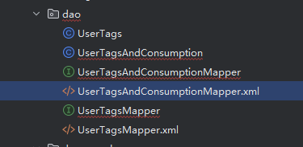

# AutoGenerateCode
AutoGenerateCode

this is a customerized idea plugin, which can generate code by database table and union sql, it very easy to use, just input generate path and click generate code button,then you can auto generate class file under your expective folder.
Let me tell you how to do.
1.First click mouse right button,then you can see a item called "Generate Code" above "New" item.

2.Second this is a dialog,you can input your database information.

3.Third you need to input databast information in this plugin.

4.Fourth you need to input table name and generate path, and click radio button "Table Name"."Dao Layer path" is generation path, and click "Generate Code" button. You can generate class file on your expective folder.

5.Fifth you can selected radio button "Union SQL", and input your union sql, and input file name, and click "Generate Code" button to generate class file by union sql.

6.Finally, we can see class file under your expective folder.

this tool according technology include IDE plugin,,gradle,swing, FreeMarker, JDBC, JAVA etc.
JDK version is 21,and gradle version is 8.13
